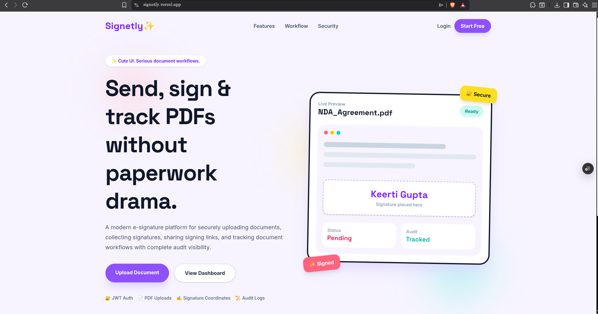
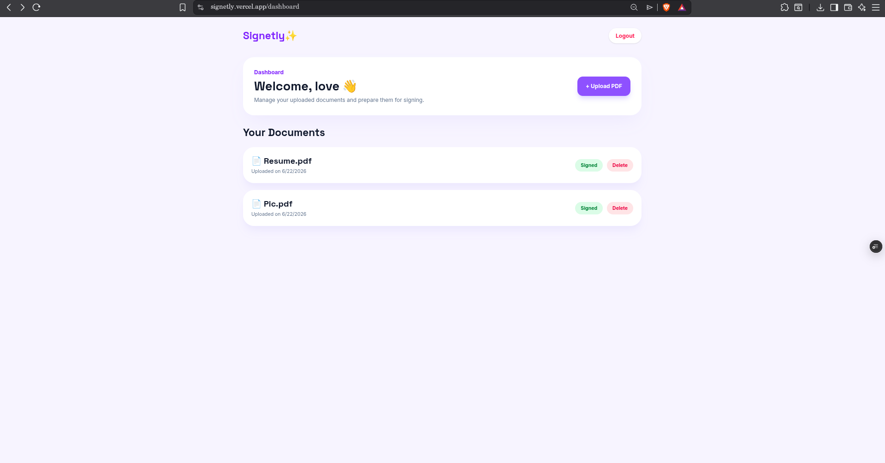
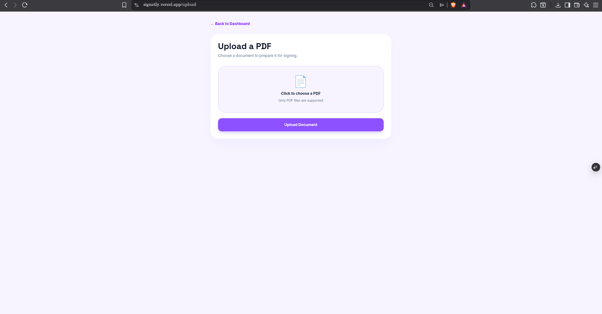
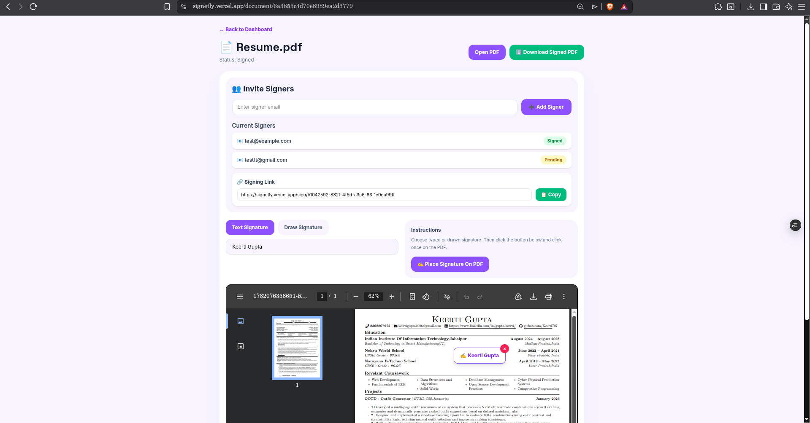
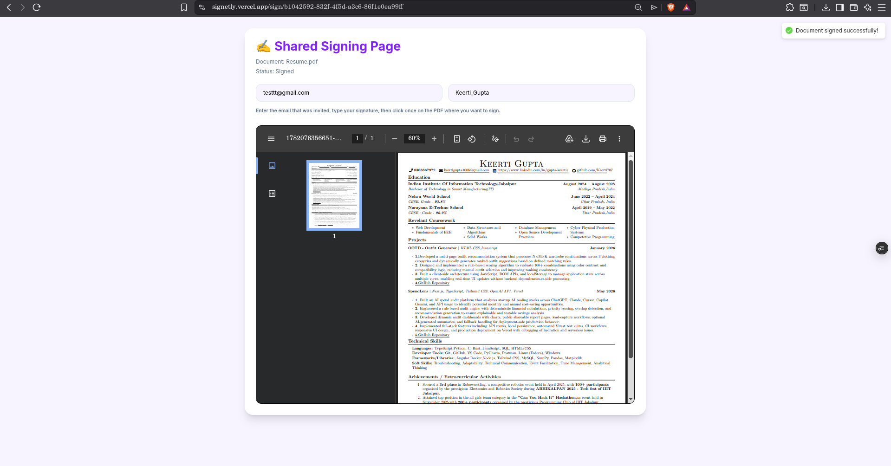
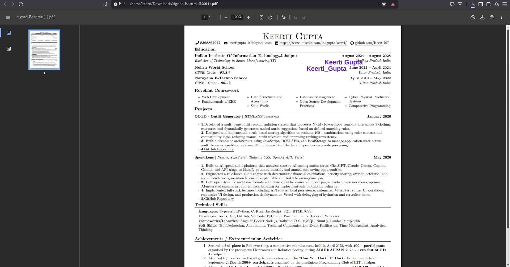

# ✨ Signetly

A modern full-stack e-signature platform that enables users to upload PDF documents, invite signers, collect signatures, track document progress, maintain audit trails, and generate downloadable signed PDFs.

### 🌐 Live Demo

**Frontend:** https://signetly.vercel.app

### 🎥 Demo Video

https://drive.google.com/file/d/1_etSmZYtuEhXMvWOdqZMzhgWJrSZKWnP/view?usp=drivesdk

---

## 🚀 Features

### 🔐 Authentication & Security

* User Registration & Login
* JWT Authentication
* Protected Routes
* Secure Password Hashing
* Document Ownership Validation

### 📄 Document Management

* Upload PDF Documents
* Dashboard-Based Document Tracking
* View Uploaded Documents
* Delete Documents
* Track Document Status

### ✍️ Digital Signatures

* Typed Signatures
* Drawn Signatures
* Drag-and-Drop Signature Placement
* Signature Position Persistence
* Edit Existing Signatures
* Delete Signatures

### 👥 Collaborative Signing

* Invite External Signers
* Secure Tokenized Signing Links
* Public Signing Workflow
* Signer Status Tracking
* Document Rejection Workflow
* Rejection Reason Tracking

### 📜 Audit Logging

Every important action is recorded:

* Document Uploads
* Signer Invitations
* Signature Placement
* Signature Updates
* Signature Deletion
* Document Signing
* Document Rejection
* Timestamp Tracking
* IP Address Tracking

### 📊 Status Lifecycle

#### Document Status

* Pending
* Partially Signed
* Signed
* Rejected

#### Signer Status

* Pending
* Signed

### 📥 PDF Generation

Powered by PDF-Lib:

* Embed Signatures
* Generate Signed PDFs
* Preserve Original Documents
* Export Downloadable Signed Versions

---

## 🏗️ System Architecture

```text
Frontend (React + TypeScript)

        ↓

REST API (Node.js + Express)

        ↓

MongoDB Atlas

        ↓

PDF Processing Layer (PDF-Lib)

        ↓

Signed PDF Generation
```

---

## 🛠️ Tech Stack

### Frontend

* React
* TypeScript
* Vite
* Tailwind CSS
* React Router
* Axios
* React Hot Toast

### Backend

* Node.js
* Express.js
* JWT Authentication
* Multer
* PDF-Lib

### Database

* MongoDB Atlas
* Mongoose

### Deployment

* Frontend: Vercel
* Backend: Railway
* Database: MongoDB Atlas

---

## 📂 Project Structure

```text
document-signature-app

├── client
│   ├── src
│   ├── pages
│   ├── components
│   ├── services
│   ├── assets
│   └── screenshots

└── server
    ├── controllers
    ├── routes
    ├── models
    ├── middleware
    └── uploads
```

---

## 🔄 Complete Workflow

### Document Owner

1. Register/Login
2. Upload PDF
3. Add Signature
4. Invite Signers
5. Share Signing Link
6. Track Signing Progress
7. Download Signed PDF

### Signer

1. Open Signing Link
2. Verify Email
3. Sign Document
4. Submit Signature

---

## 📸 Screenshots

### Landing Page



### Dashboard



### Upload Document



### Document Management



### Shared Signing Page



### Signed PDF Output



---

## 🎯 Skills Demonstrated

* Full-Stack Development
* SaaS Product Design
* REST API Development
* JWT Authentication
* MongoDB Data Modeling
* PDF Processing
* Audit Logging
* Secure File Handling
* Document Lifecycle Management
* Responsive UI Design
* Cloud Deployment

---

## 🚀 Future Enhancements

* Email Delivery Integration
* Cloud Storage (AWS S3)
* OTP Verification
* Multi-Page Signing
* Real-Time Notifications
* Role-Based Permissions
* Signature Certificates
* Team Workspaces

---

## 👩‍💻 Author

**Keerti Gupta**

Built as a portfolio-grade SaaS application demonstrating secure document lifecycle management, digital signatures, audit logging, collaborative workflows, and PDF generation.
